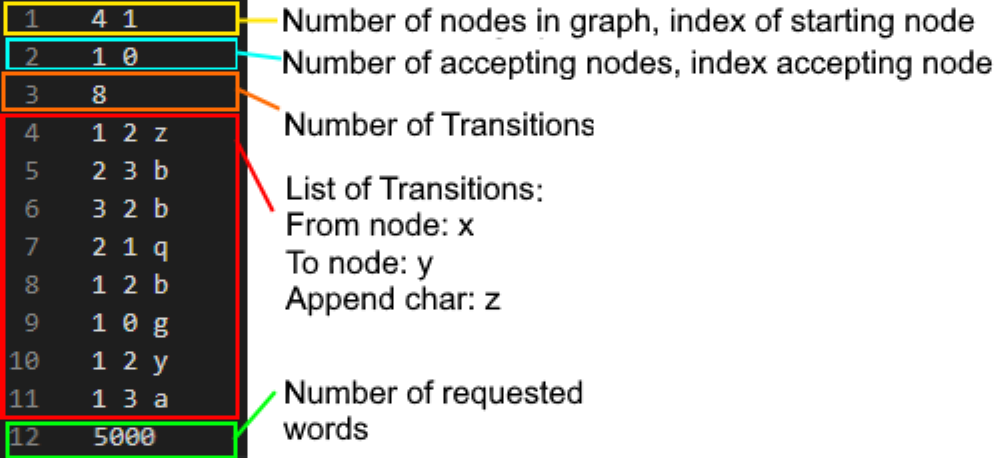

# DFA-Algorithm
An algorithm that generates all accepted strings of length up to 5000 symbols for a given Deterministic Finite Automaton (DFA). The algorithm can handle directed graphs with over 500 nodes (vertices) and 5000 transitions (edges) and find several thousand words that are accepted by the automaton in under 1 second.

## File structure:
Main.java - Is run with a test file as input argument.
DFA.java - Contains algorithm.
DFA_DATA.java - Contains data structures required to run the main.
GenerateGraph.java - Can be used to quickly create a directed graph (generates a test file).  
(Kattio.java is to compile on Kattis AND Pair.java is a basic Pair class).

#### Preview of testing file format
1. File format for test files: .in
2. How to create your own runnable file for this algorithm:

